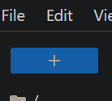
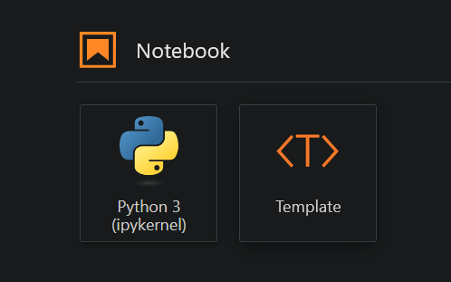
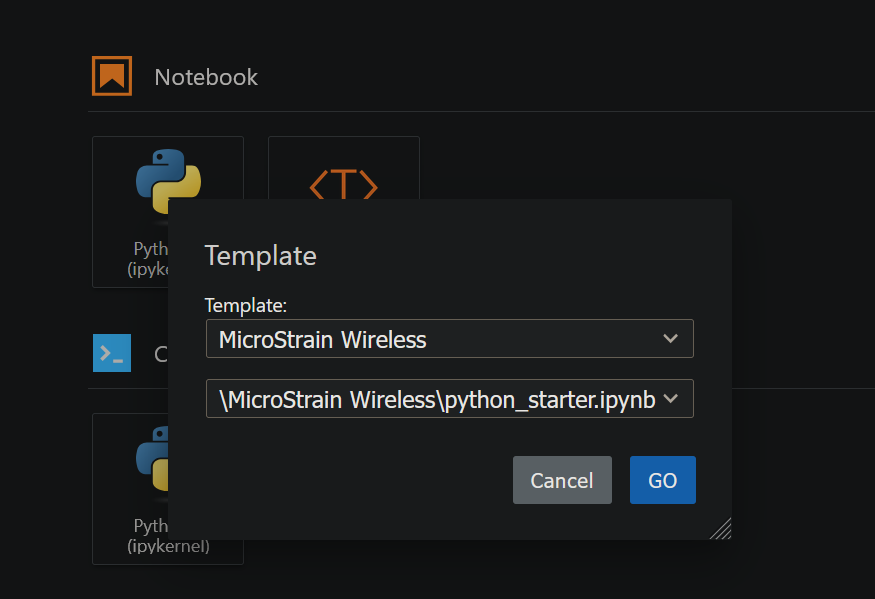

# MicroStrain Module Tools

Companion tools to enhance working with the MicroStrain Wireless OpenDAQ module:

| Tool                                                   | Supported Languages   |
| ------------------------------------------------------ | --------------------- |
| [Library](#library)                                    | C++, C#, Python |
| [JupyterLab](#interactive-prototyping-tool) | C#, Python        |

## Library

`daq_utils` is a library that simplifies working with openDAQ through extensions tailored for MicroStrain modules.

### Installation

```
pip install microstrain-daq-utils
```

To import the library into your project:

```python
import daq_utils
```

See [Usage](#usage) for examples of how to use the library.

## JupyterLab
The [JupyterLab](https://jupyterlab.readthedocs.io/en/stable/) environment comes with notebook templates for each supported language, all pre-configured with an openDAQ instance ready to use out of the box.

This is ideal for exploration, prototyping, and testing.

### Installation

```
pip install microstrain-daq-jupyter
```

> **Note:** Notebook templates require the [Library](#library) to be installed for the relevant language(s).

### C# Setup

C# notebooks require the .NET SDK and `dotnet-interactive`. After installing the .NET SDK (version 8.0 or later):

```
dotnet tool install -g Microsoft.dotnet-interactive
```

Then:

```
dotnet interactive jupyter install
```

### Running a Session

Navigate to the directory where you would like to save your notebooks and launch JupyterLab:

```
jupyter lab
```

### Creating New Notebooks

To create a new notebook from a template, click the new launcher button:



Then, click the `Template` tile in the `Notebook` section:



Then, select the desired template:



#### Available Templates

| Template | Languages  | Description |
|----------|------------|-------------|
| Starter  | Python, C# | Pre-configured openDAQ and library setup ready to use |

### Adding modules

By default, openDAQ loads modules from its installation directory. To load modules from a different location, set the `OPENDAQ_MODULE_PATH` environment variable to the desired directory.

For example, to set it to the `Downloads` directory:

**Windows**
```
setx OPENDAQ_MODULE_PATH C:\Users\username\Downloads
```

> **Note:** `setx` takes effect in new terminal sessions, not the current one. Restart your terminal before launching JupyterLab.

**Linux**
```
touch ~/.bashrc && \
sed -i '/^export OPENDAQ_MODULE_PATH=/d' ~/.bashrc && \
echo 'export OPENDAQ_MODULE_PATH=~/Downloads' >> ~/.bashrc && \
source ~/.bashrc
```

**Mac**
```
touch ~/.bashrc && \
sed -i '' '/^export OPENDAQ_MODULE_PATH=/d' ~/.bashrc && \
echo 'export OPENDAQ_MODULE_PATH=~/Downloads' >> ~/.bashrc && \
source ~/.bashrc
```


Restart the kernel whenever modules are added or updated to pick up the changes.

> **Note:** If multiple versions of the same module exist in the directory, the behavior is undefined. Remove the old version before adding the new one.

## Usage

See the openDAQ [documentation](https://docs.opendaq.com/manual/opendaq/3.30/introduction.html) for a full reference on the openDAQ API. For wireless-specific usage, see the [Wireless guide](docs/WIRELESS.md).

### Discovering devices

This code snippet will display a list of all currently available devices:

```python
for device_info in instance.available_devices:
    print('Name:', device_info.name, 'Connection string:', device_info.connection_string)
```

### Adding devices

Add a device using its connection string:

```python
device = instance.add_device('microstrain-wireless://COM46:3000000')
```

Connection strings are in the format: `prefix://address`.

### Removing devices

When you are ready to remove the device:

```python
instance.remove_device(device)
```

This will disconnect the device so you can use it in other applications.

### Getting channels

Get a reference to a channel using it's index:

```python
channel = device.get_channels()[0]
```

### Getting property groups

Properties are organized into `groups`. To print available property groups for a device, channel, group, or other root:

```python
daq_utils.print_groups(channel)
```

To get the groups as a list instead:

```python
daq_utils.groups(channel)
```

### Getting properties

To print all properties across every group:

```python
daq_utils.print_properties(channel)
```

To filter to a specific group:

```python
daq_utils.print_properties(channel, 'Setup.Configure.Sampling')
```

To get the properties as a list instead:

```python
daq_utils.properties(channel)
daq_utils.properties(channel, 'Setup.Configure.Sampling')
```

### Finding a property path

If you know a property name but not its full path, use `find` to get its full dot-notation path:

```python
daq_utils.find(channel, 'LostBeaconTimeout')
```

This can also be used for finding groups:

```python
daq_utils.find(channel, 'Sampling')
```

### Accessing properties

Properties can be accessed using dot-notation paths:

```python
timeout = channel.get_property_value('Setup.Configure.Sampling.LostBeaconTimeout')
```

They can also be set:

```python
channel.set_property_value('Setup.Configure.Sampling.LostBeaconTimeout', 7)
```

### Inspecting function properties

To view a function property's description, arguments, and return type, read the `description` field from the property:

```python
print(channel.get_property('Capabilities.MaxSweeps').description)
```

### Calling function properties

Function properties can be called directly through the openDAQ API, but the wrapper simplifies the syntax. To call a function with no arguments using the wrapper:

```python
result = daq_utils.call(channel, "Setup.Configure.Apply")
```

To call a function with arguments:

```python
result = daq_utils.call(channel, "Capabilities.InputRangesWithVoltage", 0xFF, 5000)
```

The result object can then be queried for any returned properties. For example:

```python
success = result.get_property_value('Success')
```

### Inspecting types

To view what fields/values are available for openDAQ `Enumeration` and `Struct` types, create a `DaqTypeInspector`:

```python
inspector = daq_utils.DaqTypeInspector(instance)
```

To inspect a type:

```python
inspector.describe('MSCL_Wireless_AutoCalCompletionFlag')
```

### Creating typed values

To create openDAQ typed values such as `Enumerations` and `Structs`, use `DaqTypeFactory`. It handles the type manager and string conversion automatically:

```python
daq_types = daq_utils.DaqTypeFactory(instance)
```

#### Creating an enum value

Use `enum()`:

```python
voltage = daq_types.enum("MSCL_Wireless_Voltage", "voltage_3000mV")
```

#### Creating a Struct value

Pass a Python dict with the struct's fields to `struct()`. Python primitives are converted automatically, and openDAQ types such as enumerations are passed through as-is:

```python
cmd_info = daq_types.struct(
    "MSCL_Wireless_ShuntCalCmdInfo",
    {
        "UseInternalShunt": True,
        "NumActiveGauges": 1,
        "GaugeResistance": 350,
        "ShuntResistance": 100000,
        "GaugeFactor": 2.0,
        "InputRange": daq_types.enum("MSCL_Wireless_InputRange", "range_14_545mV"),
        "HardwareOffset": 0,
        "ExcitationVoltage": daq_types.enum("MSCL_Wireless_Voltage", "voltage_1500mV")
    }
)
```
